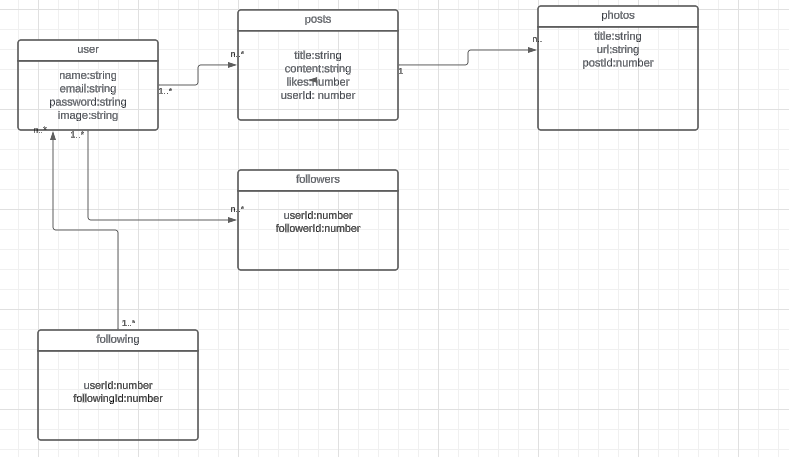

# Orkut: Integração de Mensageria

## Descrição (Projeto em construção)

- Este é o projeto Orkut, uma aplicação inspirada na antiga rede social Orkut. 
- O backend foi desenvolvido utilizando Node.js, Express, Sequelize e TypeScript, e fornece APIs REST para gerenciar usuários e posts.
- O front-end foi utiizado o React-vite com typeScript.
- Para melhorar a escalabilidade e a resiliência da aplicação, foi integrada uma camada de mensageria utilizando RabbitMQ.


## Pré-requisitos

- Node.js (v16)
- NPM ou Yarn
- MySQL
- Docker

## Configuração

1. Clone o Repositório

```shell
  git clone <URL>
  cd orkut
```

## Execute o Docker Compose para iniciar a aplicação e o RabbitMQ:

```shell
  docker compose up --build
```
2. Configuração do Banco de Dados
- Todas as configuração de banco de dados entara dentro do diretório: backend/src/database/config/database
- Ao rodar o 'docker compose', toda a aplicação estará disponivel dentro do docker.'localhost:3001' para frontend e 
'localhost:3000' para backend.

3. Configure o .env do backend,  conforme o .env.example

- A integração da mensageria permitirá uma melhor comunicação assíncrona entre os serviços, aumentando a escalabilidade e a resiliência da aplicação.

4. 